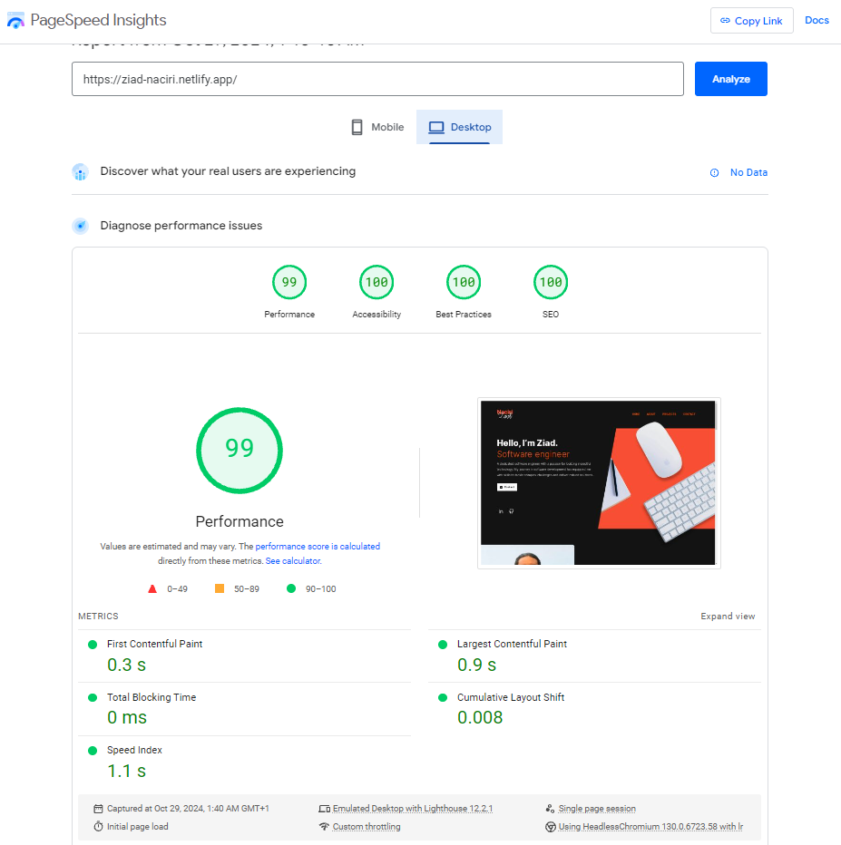
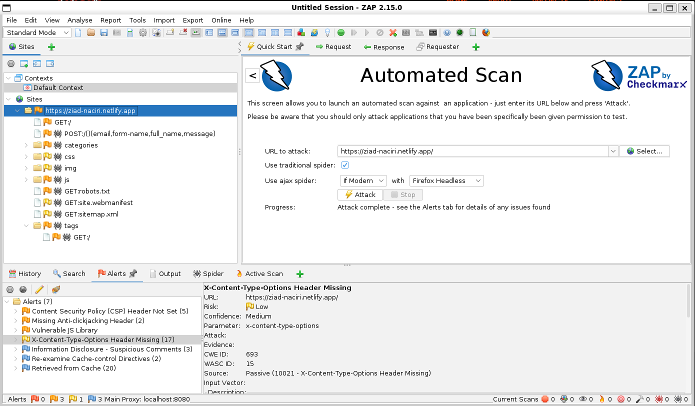
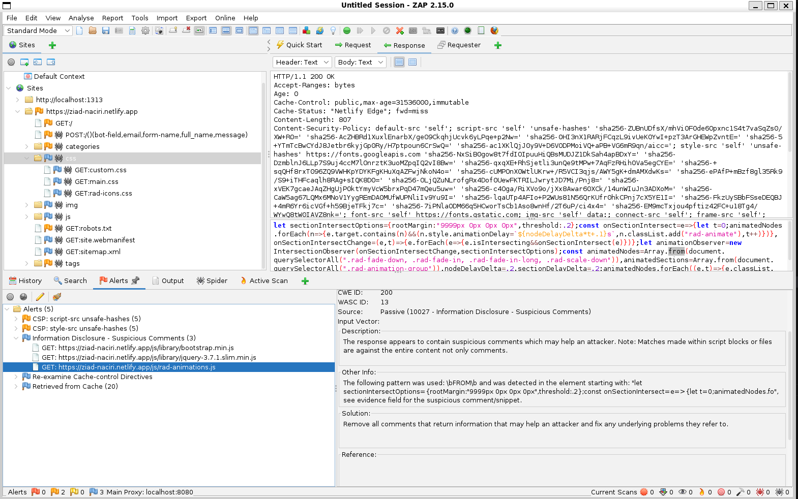

# Hugo Portfolio Project Guide

## Project Overview

This project is a secure and high-performance personal portfolio website developed using [Hugo](https://gohugo.io/), a fast and flexible static site generator written in Go. The portfolio demonstrates modern web development practices, including security hardening, performance optimization, and responsiveness. It is designed to showcase advanced features and best practices, with a particular focus on security and efficiency.

**Live Demo:** [https://ziad-naciri.netlify.app/](https://ziad-naciri.netlify.app/)  
**Repository:** [GitHub - Hugo Portfolio](https://github.com/Ziad-Naciri/hugo-portfolio/)

---
## Objectives:

- [x] **Modern, responsive design**: The portfolio is modern and responsive across different devices.
- [x] **Advanced security features**:
  - [x] **HTTPS**: HTTPS is enabled on the site.
  - [x] **CSP, input validation, security headers**: CSP is configured, headers are added, and input validation confirmed.
  - [x] **Regular security audits**: OWASP ZAP security test performed.
- [x] **Performance optimization**:
  - [x] **Image optimization**: Images are compressed and WebP format is used.
  - [x] **Lazy loading**: Enabled for images.
  - [x] **Code minification**: HTML, CSS, and JavaScript are minified.
- [x] **Web analytics and error tracking**:
  - [x] **Netlify Analytics**: Confirmed active tracking ID.
- [x] **Learning Go and Hugo**: Hugo and Go usage demonstrated.
- [x] **Highlighting SSG benefits**: Portfolio shows SSG benefits, speed, and security.

## Methodology:

- [x] **Design Phase (Figma)**: Wireframes created.
- [x] **Development Phase**:
  - [x] **Initialized Hugo project**: Confirmed in the repository.
  - [x] **Netlify integration**: Successfully deployed.
  - [x] **Version control with Git**: Confirmed repository usage.
- [x] **Content Management and SEO**:
  - [x] **Meta tags, schema, sitemap**: Ensure meta tags and sitemap are present.
- [x] **Security Implementation**:
  - [x] **HTTPS**: Enabled.
  - [x] **CSP, input validation, security headers**: Implemented usage of hashes to load ressources from different origins for styles and scripts.
- [x] **Performance Enhancements**:
  - [x] **Image optimization**: Images optimized.
  - [x] **Lazy loading**: Confirmed.
  - [x] **Code minification**: Minified code.
- [x] **Analytics and Monitoring**:
  - [x] **Netlify Analytics**: Active.
  - [ ] **Sentry for error tracking**: Sentry not supported for Hugo/ Will implement repot Uri in the CSP instead.
- [x] **Testing Phase**:
  - [x] **Security testing with OWASP ZAP**: Completed with informational uncompromising alerts.
  - [x] **Unit tests, performance testing with Google Lighthouse**: Passed with 98 Performance, 100 SEO ,100 in Best Practices and 100 in Accessibility.
- [x] **Deployment Phase**:
  - [x] **Continuous deployment on Netlify**: Continuous deployment set up, Visit [Ziad's Portfolio](https://ziad-naciri.netlify.app/).

## Google Lighthouse test result:
- The Google PageSpeed Insights report, which leverages Lighthouse, Google's open-source, automated tool, indicates that the portfolio website hosted at https://ziad-naciri.netlify.app performs excellently across multiple benchmarks. Lighthouse evaluates various aspects of web performance, accessibility, best practices, and SEO, providing a holistic view of the website's quality, [checkout test results here](https://pagespeed.web.dev/analysis/https-ziad-naciri-netlify-app/wykzch4isv?form_factor=desktop).

---
# OWASP ZAP Security Test Results:

## OWASP ZAProxy Alerts:

## Added Custom Content Security Policy
### XSS / Data Injection Attacks Mitigation
- Avoided using `unsafe-inline` and `unsafe-eval`.
- Used the hashes approach; `unsafe-hashes` was necessary to run some scripts crucial for the theme.
- Only trusted the explicitly listed hashes.
- Deployed to Netlify and configured proper CSP in the `netlify.toml` deployment file.
  
### TODO - Add `report-uri` for CSP violation reporting.

## CSRF Mitigation - Contact Form
- Started using [Netlify Spam filters](https://docs.netlify.com/forms/spam-filters/) which leverage Akismet, an industry leader in spam detection, to filter undesired spam.
- Implemented a honeypot field to detect and block bot submissions.
- Added specific caching headers to ensure the contact form is always served fresh to users:
  - **Cache-Control**: Set to `no-store, no-cache, must-revalidate, proxy-revalidate` for the contact form path (`/`), ensuring that form submissions are not cached, thereby minimizing security risks.
  - **Pragma**: Set to `no-cache` as an additional directive for legacy caches.
  - **Expires**: Set to `0` to indicate the content should be treated as immediately expired.

## Updated Vulnerable Libraries

### Updated Vulnerable jQuery Library — "jquery-3.3.1.slim.min.js"
- **Issue**: The theme included a vulnerable version of jQuery (3.3.1.slim.min.js), detected by OWASP ZAP.
- **Details**:
  - The identified version has known vulnerabilities, including those in:
    - **CVE-2020-11022** and **CVE-2020-11023**: These involve cross-site scripting risks due to improper sanitization.
    - **CVE-2019-11358**: This allows prototype pollution, enabling attackers to manipulate JavaScript objects and properties.
- **Solution**: Updated to the latest [jQuery version 3.7.1](https://blog.jquery.com/2023/08/28/jquery-3-7-1-released-reliable-table-row-dimensions/), which includes patches for these issues.

## Configured X-Content-Type Header
- Added `X-Content-Type-Options: nosniff` to prevent MIME-type sniffing, reducing the risk of executing untrusted files. [MDN Reference](https://developer.mozilla.org/en-US/docs/Web/HTTP/Headers/X-Content-Type-Options)

## Cache Control for Static Assets
- **Cache-Control**: Set to `public, max-age=31536000, immutable` for static assets (e.g., images, CSS, JavaScript files). This enables the browser to cache these files for one year, improving load times for repeat visitors by reducing server requests.  
  - **Reference**: [Mozilla Documentation on Cache-Control](https://developer.mozilla.org/en-US/docs/Web/HTTP/Headers/Cache-Control)
   

## Enhanced Security Headers
- **Referrer-Policy**: `strict-origin-when-cross-origin` to limit the information shared in referrer headers, reducing potential data exposure.
  - [MDN Documentation](https://developer.mozilla.org/en-US/docs/Web/HTTP/Headers/Referrer-Policy)

- **X-Frame-Options**: `DENY` to prevent clickjacking attacks by blocking framing on other sites.
  - [MDN Documentation](https://developer.mozilla.org/en-US/docs/Web/HTTP/Headers/X-Frame-Options)

- **X-XSS-Protection**: `1; mode=block` to block the page if an XSS attack is detected, providing an extra layer of protection.
  - [MDN Documentation](https://developer.mozilla.org/en-US/docs/Web/HTTP/Headers/X-XSS-Protection)

# Security Assessment

After conducting an OWASP ZAP security test, multiple several key security measures were implemented to enhance the portfolio's safety while minimizing any potential vulnerabilities. 

This included setting a strict Content Security Policy (CSP) using explicit hashes to allow only trusted scripts, optimizing cache control policies for both static assets and sensitive areas like the contact form, updating vulnerable libraries, and adding essential security headers like `X-Content-Type-Options`, `Referrer-Policy`, `X-Frame-Options`, and `X-XSS-Protection`.

The remaining alerts, such as those for `unsafe-hashes`, were necessary to load the theme's content securely.
 
The OWASP ZAP alerts flagged as "Suspicious Comments," "Re-examine Cache-Control Directives," and "Retrieved from Cache" are purely informational with no security risks. After review, these comments are confirmed as harmless or false positives, and caching alerts apply only to safe, public resources.
